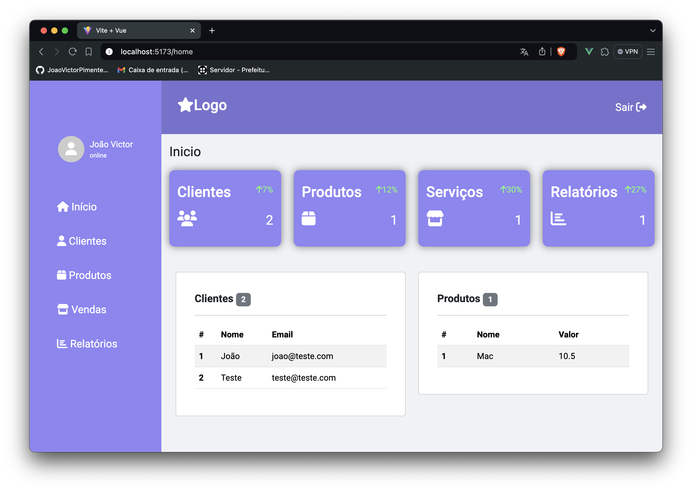

### Dashboard

 

Projeto feito para estudar o desacoplamento do frontend e backend

Nessa dashboard o VueJs consegue acessar minha API feita em Laravel e fazer a listagem dos Clientes e Produtos que estão cadastrados no banco de dados!

